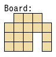
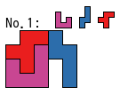
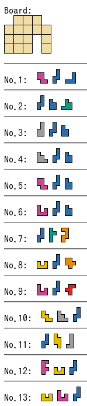
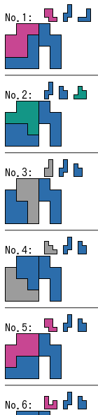

ubongo-utils
============
ubongo-utils is a set of utilities for Ubongo, Ubongo Mini, Ubongo Duel
and Ubongo 3-D puzzle games designed by Grzegorz Rejchtman.
Ubongo Extreme (hexagonal tiles) or Ubongo Trigo (triangle tiles) is
not supported.  It runs on UNIX based operating systems including Linux.
All utilities are designed to be invoked on a command line.  

ubongo-utils currently provides the following programs:

* Solver
* Analyzer
* HTML converter

and some auxiliary utilities.

Solver
------
THE 'Solver' utility solves a puzzle.  ubongo-utils provides a solver
command for each Ubongo variant.

* `ubongo-solve-orig`   (for Ubongo)
* `ubongo-solve-duel`   (for Ubongo Duel)
* `ubongo-solve-minib`  (for Ubongo Mini - blue tiles)
* `ubongo-solve-minig`  (for Ubongo Mini - green tiles)
* `ubongo-solve-minir`  (for Ubongo Mini - red tiles)
* `ubongo-solve-miniy`  (for Ubongo Mini - yellow tiles)
* `ubongo-solve-3d`     (for Ubongo 3-D)

Specifying shape of a board and pieces placed on it, 'Solver' outputs
its solutions.  The shape of a board is represented with a text file.
Here is an example:

    .###.
    #####
    ###.#
    ###.#

Each character '#' is a square printed on the board.  The actual board
corresponding with the text file above looks like:

To specify pieces placed on the board, upper letters ('A', 'B', 'C' ...)
are used.  An unique letter is assigned to each piece in an Ubongo
variant.

Ubongo:

A: 
B: 
C: 
D: 
E: 
F: 
G: 
H: 

I: 
J: 
K: 
L: 

Ubongo Duel:

A: 
B: 
C: 
D: 
E: 
F: 
G: 
H: 

I: 
J: 
K: 
L: 
M: 
N: 
O: 
P: 

Q: 
R: 
S: 
T: 
U: 

Ubongo Mini - Blue Tiles:

A: 
B: 
C: 
D: 
E: 
F: 
G: 

Ubongo Mini - Green Tiles:

A: 
B: 
C: 
D: 
E: 
F: 
G: 

Ubongo Mini - Red Tiles:

A: 
B: 
C: 
D: 
E: 
F: 
G: 

Ubongo Mini - Yellow Tiles:

A: 
B: 
C: 
D: 
E: 
F: 
G: 

Ubongo 3-D:

A: 
B: 
C: 
D: 
E: 
F: 
G: 
H: 

I: 
J: 
K: 
L: 
M: 
N: 
O: 
P: 

Suppose that you'd like to solve a puzzle for Ubongo Duel, with the
board above saved as the text file 'board1.txt', and with the piece
'C', 'L' and 'R'.  Type the following line to execute the solver.

    $ ubongo-solve-duel board1.txt C L R

The 'Solver' program, the 'ubongo-solve-duel' command, will output
a solution:

    * C L R
    .LLC.
    LLRCC
    RLR.C
    RRR.C

It means that the solution looks like:

'Solver' program for Ubongo 3-D, 'ubongo-solve-3d' command, outputs
text data slightly different from other solver programs:

    FFOE
    .FFE
    ====
    FOOO
    .EEE

The lines before the horizontal rule '====' represents the second level
(i.e. the first floor) of the solution and lines after the horizontal
rule are the first level (i.e. the ground floor), respectively.

The common form of the solver commands is:

    solver-program [option...] BOARD-FILE PIECE...

or

    solver-program [option...] -f PROBLEM-FILE BOARD-FILE

PIECE is an upper letter ('A', 'B', 'C' ...) assigned to a piece.
PROBLEM-FILE is a file which describes combinations of pieces, one 
combination per a line.  An example of PROBLEM-FILE is shown below:

    * A C P
    * B C E
    * B C M
    * B C N
    * B C P
    * B C R

When PROBLEM-FILE is specified, the solver tries to solve all puzzles
described in the file.  Note that result data output by 'Analyzer' 
(described later) can also be used as PROBLEM-FILE.
You can specify either PROBLEM-FILE or PIECE, but not both.

The solver programs recognize the options described below:

* -a, --all

By default, the solver programs display only one solution.  Specifying
this option, solvers output all solution of the puzzle.

* -f FILE, --file FILE

Read a list of combinations of pieces from FILE.

* -h, --help

Print command line usage, then exits.

* -v, --version

Print a version number, then exits.

The solver programs exit with the exit code 0 (success) even when the
puzzle has no solution.

Analyzer
--------
The 'Analyzer' utility is similar to 'Solver', but it assists you in
creating puzzles.  Specifying a board file and how many pieces are
placed on it, 'Analyzer' outputs all solvable combinations of pieces.

Suppose that you'd like to create three piece puzzles of Ubongo Duel.
Since there are 21 kinds of pieces in Ubongo Duel, 'Analyzer' tries
solving

C(21, 3) = (21 * 20 * 19) / (3 * 2 * 1) = 1330

ways of combinations of pieces, and it outputs all solvable combinations
of pieces for the given board, like this:

    $ ubongo-analyze-duel board1.txt 3
    .###.
    #####
    ###.#
    ###.#
    ; squares=16

    * A C P ; solutions=1
    * B C E ; solutions=1
    * B C M ; solutions=1
    * B C N ; solutions=1
    * B C P ; solutions=1
    * B C R ; solutions=2
    * C D H ; solutions=1
    * C I T ; solutions=1
    * C L R ; solutions=1
    * C N U ; solutions=1
    * C O S ; solutions=1
    * C Q T ; solutions=1
    * C R T ; solutions=1
    ; puzzles=13

Same as 'Solver', ubongo-utils also provides an analyzer command for
each Ubongo variant.

* `ubongo-analyze-orig`   (for Ubongo)
* `ubongo-analyze-duel`   (for Ubongo Duel)
* `ubongo-analyze-minib`  (for Ubongo Mini - blue tiles)
* `ubongo-analyze-minig`  (for Ubongo Mini - green tiles)
* `ubongo-analyze-minir`  (for Ubongo Mini - red tiles)
* `ubongo-analyze-miniy`  (for Ubongo Mini - yellow tiles)
* `ubongo-analyze-3d`     (for Ubongo 3-D)

In output data, a character ';' means beginning of a comment.  Each
comment ends with a newline.  'Analyzer' also outputs solutions if
the '--show-solution' option is specified:

    $ ubongo-analyze-duel --show-solution board1.txt 3
    .###.
    #####
    ###.#
    ###.#
    ; squares=16

    * A C P ; solutions=1
    .PPC.
    PPACC
    PPA.C
    AAA.C

    * B C E ; solutions=1
    .EEC.
    EEECC
    BBE.C
    BBB.C

    * B C M ; solutions=1
    .MMC.
    (snip)

The common form of the analyzer commands is:

    analyzer-program [option...] BOARD-FILE NPIECES

The format of BOARD-FILE is the same as that of 'Solver'.
NPIECIES must be an integer greater than zero.
The analyzer programs recognize the following options:

* -a, --all-solutions

Show all solutions.  This option implies '--show-solution'.

* -h, --help

Print command line usage, then exits.

* -m N, --max-solutions=N

Output solvable combinations of pieces with N solutions or less only.

* -s, --show-solution

Also output a solution.

* -v, --version

Print a version number, then exits.

The analyzer programs exit with the exit code 0 (success) even when
it has reported no solvable combinations of pieces.

HTML Converter
--------------
'HTML converter' converts a text file to an HTML file and PNG image
files.  The text file may contains one of the following data:

* Shapes of boards
* Solutions output by 'Solver'
* A list of combinations of pieces output by 'Analyzer'

Same as 'Solver' and 'Analyzer', ubongo-utils provides a converter
command for each Ubongo variant.

* `ubongo-html-orig`   (for Ubongo)
* `ubongo-html-duel`   (for Ubongo Duel)
* `ubongo-html-minib`  (for Ubongo Mini - blue tiles)
* `ubongo-html-minig`  (for Ubongo Mini - green tiles)
* `ubongo-html-minir`  (for Ubongo Mini - red tiles)
* `ubongo-html-miniy`  (for Ubongo Mini - yellow tiles)
* `ubongo-html-3d`  (for Ubongo 3-D)

If you'd like to convert the board file 'board1.txt' for Ubongo Duel,
type:

    $ ubongo-html-duel board1.txt

It generates 'board1.html' and some PNG files at the current directory.
The created HTML page looks like:

If you want to create an HTML page of a solution, do it like this way:

    $ ubongo-solve-duel board1.txt C L R > solution1.txt
    $ ubongo-html-duel solution1.txt

It generates 'solution1.html' and PNG files at the current directory.
The HTML page looks like:

To convert a list of combinations of pieces, run the following commands:

    $ ubongo-analyze-duel board1.txt 3 > combinations1.txt
    $ ubongo-html-duel --problem combinations.txt

It makes 'combinations1.html' and PNG files.  The HTML page looks like:

'combinations1.html' may contains solutions.  'HTML Converter' also
converts solutions.

    $ ubongo-analyze-duel --show-solution board1.txt 3 > combinations1.txt
    $ ubongo-html-duel combinations.txt

The generated HTML page looks like:

The common form of the analyzer commands is:

    html-converter-program [option...] TEXT-FILE

The 'HTML Converter' programs recognize the following options:

* -b BASENAME, --basename=BASENAME

Create an HTML file with the filename 'BASENAME.html' and create PNG
files for representing board and solutions with the filenames starting
with 'BASENAME-'.  The default value is basename of TEXT-FILE.

This option changes basenames of output files.  To change an output
directory, use '--output-prefix' instead.

* -h, --help

Print command line usage, then exits.

* -p, --problem

Do not output solutions.  Output problems (combinations of pieces)
only.

* -o PREFIX, --output-prefix=PREFIX

Generate an HTML file at the directory PREFIX.  This options also
changes locations of PNG files generated by 'HTML Converter'.
The default value is '.'.  Also see description of '--basename',
'--board-directory', '--solution-directory' and '--piece-directory'
options.

* -v, --version

Print a version number, then exits.

* --problem-size=SIZE

Specify size of PNG files for representing pieces as problems.
In generated image files, pieces consist of squares with sides SIZE
pixels.  'HTML Converter' for Ubongo 3-D ignores this option.
The default value is 6. 

* --board-size=SIZE

Specify size of PNG files for representing boards.  In generated image
files, boards consist of squares with sides SIZE pixels.
The default value is 16 

* --solution-size=SIZE

Specify size of PNG files for representing solutions.  In generated
image files, solutions consist of squares with sides SIZE pixels.
The default value is 16. 

* --board-directory=DIR

Create PNG files for representing boards at the directory DIR.
relative to a directory where an HTML file resides.  For example,
specifying 'images/boards' as DIR, the generated HTML page contains
'img' tags like:

    

The default value is '.'. 

* --solution-directory=DIR

Create PNG files for representing solutions at the directory DIR,
relative to a directory where an HTML file resides.  For example,
specifying 'images/solutions' as DIR, the generated HTML page contains
'img' tags like:

    

The default value is '.'. 

* --piece-directory=DIR

Creates PNG files for representing pieces at the directory DIR, 
relative to a directory where an HTML file resides.  For example,
specifying 'images/pieces' as DIR, the generated HTML page contains
'img' tags like:

    

The default value is '.'. 

* --title=TITLE

Specify title of an HTML page.
The default value is "_GAME TITLE_ Problems" if '--problem' option
is specifed, or "_GAME TITLE_ Solutions" otherwise.
_GAME TITLE_ here is "Ubongo", "Ubongo Duel", "Ubongo Mini" or
"Ubongo 3-D".

Auxiliary utilities
-------------------
'ubonbo-utils' provides some auxiliary utilities.  This chapter
explains them.

### Generic solver ###
Since 'Solver' programs described in the 'Solver' chapter is
specialized in solving a particular Ubongo variant, it cannot solve
other 'Filling squares' puzzle.  'ubongo-solve-duel' can solve
Ubongo Duel puzzles, but it cannot solve other puzzles.

'ubongo-utils' also provides 'Generic Solver' utility named
'ubongo-solve-dir'.  It can solve and analyze generic 'Filling squares'
puzzles.

The most famous 'Filling squares' puzzle is 'Pentomino'.  The generic
solver can solve 'Pentomino' puzzles, of course.

The common form of the 'ubongo-solve-dir' command is the same as
other 'Solver':

    ubongo-solve-dir [option...] BOARD-FILE PIECE...

or

    ubongo-solve-dir [option...] -f PROBLEM-FILE BOARD-FILE

In addition, 'ubongo-solve-dir' recognizes '--pieceset-directory'
('-p' for short) option:

* -p DIR, --pieceset-directory=DIR

Read data about a set of pieces used in the puzzle from DIRECTORY.
If DIR is not an absolute path, 'ubongo-solve-dir' assumes it is 
relative to '/usr/local/share/ubongo-utils' (if 'ubongo-utils' has
been installed under '/usr/local').  The default value of DIRECTORY
is '.' (the current directory).

'ubongo-duel' installs the following piece-set data under 
'/usr/local/share/ubongo-utils'.

* orig (Ubongo)
* duel (Ubongo Duel)
* minib (Ubongo Mini - blue tiles)
* minig (Ubongo Mini - green tiles)
* minir (Ubongo Mini - red tiles)
* miniy (Ubongo Mini - yellow tiles)
* pentomino (Pentomino)

Note that piece-set data for Ubongo 3-D also exists but it cannot be
used by 'ubongo-solve-dir'.  'ubongo-solve-dir' can solve 2-D puzzles
only.

For example,

    $ ubongo-solve-dir -p duel board1.txt C L R

results the same as:

    $ ubongo-solve-duel board1.txt C L R

but 'ubongo-solve-dir' may be slower than 'ubongo-solve-duel' a bit,
since 'ubongo-solve-dir' reads data from files.

### Generic analyzer ###
'ubongo-utils' also provides 'Generic analyzer', 'ubongo-analyze-dir'. 
Its usage is the same as other 'Analyzer' programs and it can recognizes
'--pieceset-directory' ('-p' for short) option like 'ubongo-solve-dir'.

### Board shape comparison tool ###

The 'ubongo-compare' command is an utility for checking duplicate of
board files.  Suppose that the shape data of 'board1.txt' is:

    .###.
    #####
    ###.#
    ###.#

and 'board2.txt' is:

    .###
    ##..
    ####
    ####
    .###

The two board files have different data, but their shapes are identical.
The shape rotated right 90 degrees of 'board2.txt' is equivalent to
'board1.txt'.  Execute 'ubongo-compare':

    ubongo-compare board1.txt board2.txt

then the command reports:

    duplicate: board01
           and board02

You can specify three or more board files to 'ubongo-compare' at once.
The common form of the 'ubongo-compare' command is:

    ubongo-compare [option...] BOARD-FILE BOARD-FILE...

It recognizes the following options:

* -h, --help

Print command line usage, then exits.

* -n, --no-flip

During duplicate checks, 'ubongo-compare' rotates and flips board shapes.
This option tells 'ubongo-compare' not to flip board shapes.  Please
specify this option when you check board files for Ubongo Mini.

* -v, --version

Print a version number, then exits.
